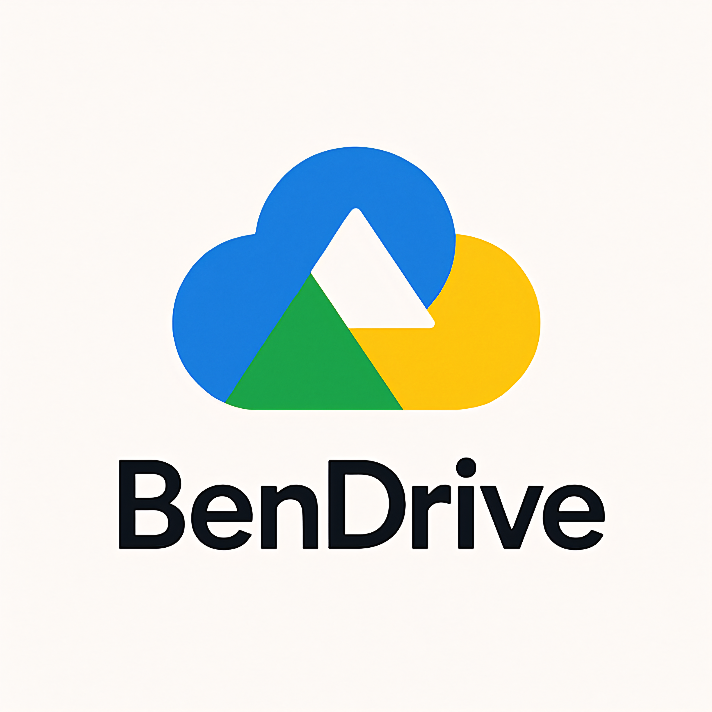

# BenDrive

  

BenDrive is a modern, full-featured cloud storage platform — a powerful clone of services like **Google Drive** and **OneDrive**. It allows users to store, organize, and share their files securely from anywhere with a sleek, user-friendly interface.

---

## 🚀 Features

BenDrive provides a seamless and efficient way to manage your files online. Here’s what you can expect:

- **Cloud Storage** – Upload, organize, and manage files without worrying about running out of local storage space.
- **Accessibility Anywhere** – Access your files from any device, anytime, anywhere — all you need is an internet connection.
- **No Downloads Required** – Use the web-based platform without installing heavy software.
- **Real-Time Sync** – Keep your files updated across all devices instantly.
- **Secure File Management** – Your data is protected with encryption and safe storage practices.
- **Collaboration Tools** – Share files or folders with others and control permissions for secure teamwork.
- **Search & Filters** – Quickly find files using search and smart filters.
- **Clean UI/UX** – A simple, intuitive interface that keeps file management stress-free.

---

## 🛠️ Tech Stack

- **Backend:** Designed and implemented by [Benyamin](https://github.com/Benfoxyy)  
- **Frontend:** Developed by [Sharafi](https://github.com/Amir-Sharafi-86)  
- **UI/UX:** Crafted with a focus on clarity, speed, and usability

---

## 📌 Goals

BenDrive aims to offer a **secure, accessible, and easy-to-use** cloud platform that rivals popular cloud services, giving users a reliable alternative to Google Drive or OneDrive — with a beautifully designed interface.
